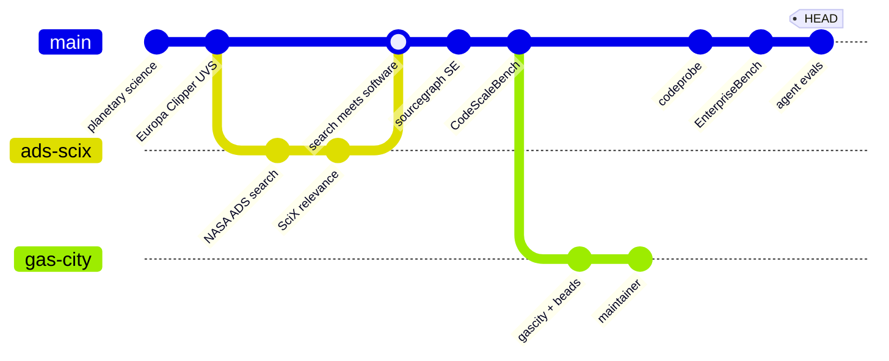

  

  
    I build benchmarks for AI coding agents, so the profile runs one on me
    &nbsp;·&nbsp;
    readout refreshed from real commit activity by <a href="generate_readout.py"><code>generate_readout.py</code></a>
    &nbsp;·&nbsp;
    <a href="https://sjarmak.ai"><strong>sjarmak.ai</strong></a>
  

  career as a commit graph: measurement is the trunk; Gas City is an active branch, not a departure

Plain-text version, with evidence

I build tooling and benchmarks for AI coding agents[^1], maintain the Gas City multi-agent orchestration ecosystem[^2], and hold that a claim about agents is worth exactly the evidence behind it. Previously Sourcegraph[^3]; before that, planetary science and NASA ADS search[^4].

[^1]: [codeprobe](https://github.com/sjarmak/codeprobe) (evals from your own merged PRs, on PyPI), [EnterpriseBench](https://github.com/sjarmak/EnterpriseBench) (112 enterprise-scale tasks), [migration-evals](https://github.com/sjarmak/migration-evals) (tiered oracles anchored to merged-PR survival), [agent-diagnostics](https://github.com/sjarmak/agent-diagnostics) (11,995 labeled failure trials), [mg-ax](https://github.com/sjarmak/mg-ax), [CodeScaleBench-Public](https://github.com/sjarmak/CodeScaleBench-Public).
[^2]: [gastownhall](https://github.com/gastownhall): gascity, beads, dashboard, packs. Contributions stage in [my forks](https://github.com/sjarmak/gascity) before landing upstream. Research on the same stack: [agent-code-authorship](https://github.com/sjarmak/agent-code-authorship) (72-89% of surviving 2024+ lines in 151 popular repos are agent-written; trailers admit to 14.5%), [mem](https://github.com/sjarmak/mem) (agentic memory benchmarked on 6,691 real work items). Tooling: [livedocs](https://github.com/sjarmak/livedocs), [tom-swe](https://github.com/sjarmak/tom-swe), [agent-workflows](https://github.com/sjarmak/agent-workflows), [brains](https://github.com/sjarmak/brains).
[^3]: Sales engineering and the CodeContextBench benchmark family, archived on this profile as work history.
[^4]: Europa Clipper UVS observation planning and Mars granular-flow simulation, archived here; the thread continues in [scix-agent](https://github.com/sjarmak/scix-agent), a 15-tool MCP server over the 32.4M-paper NASA ADS/SciX corpus, and [nls-finetune-scix](https://github.com/sjarmak/nls-finetune-scix).

