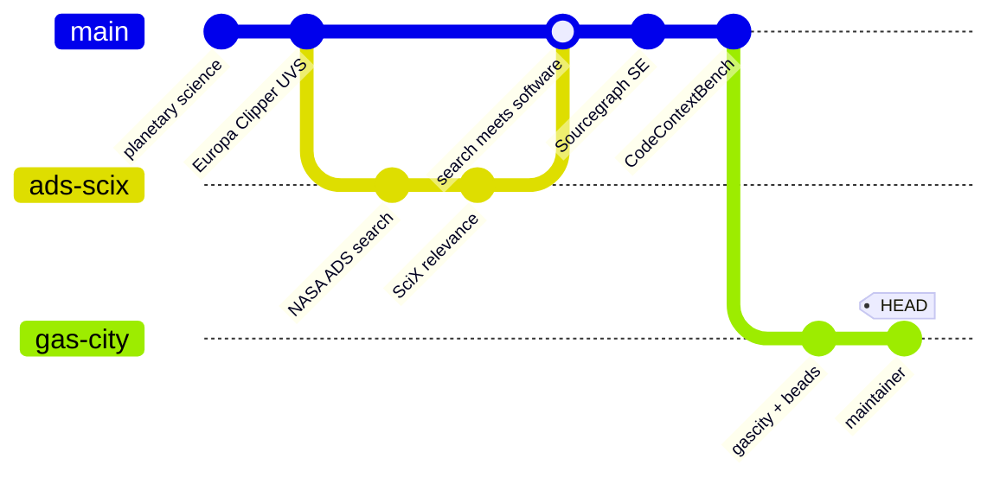
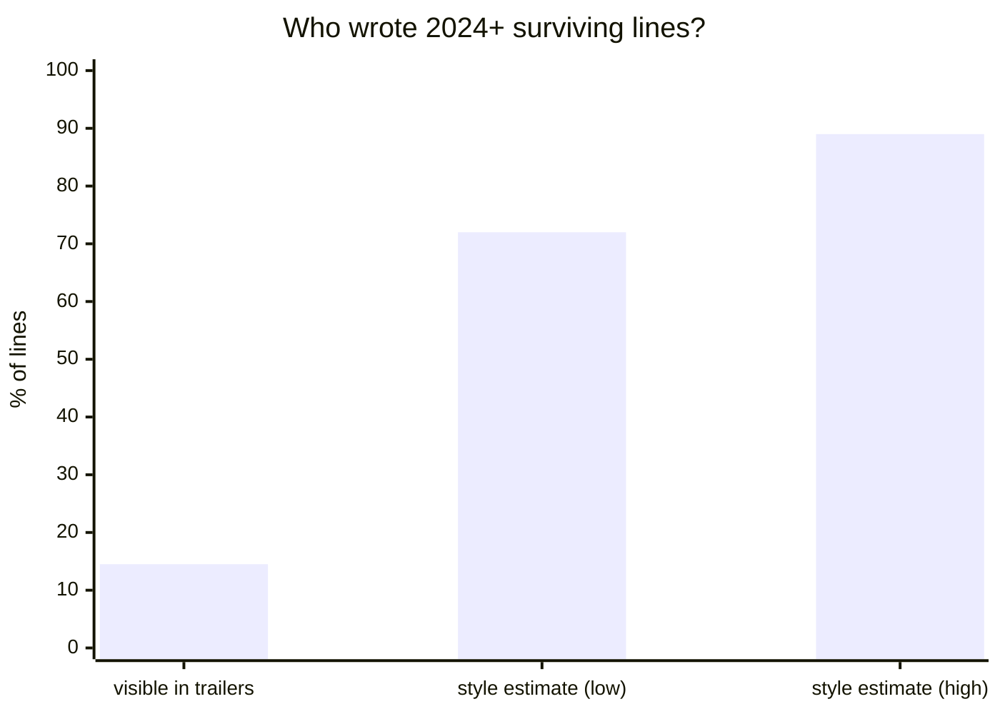
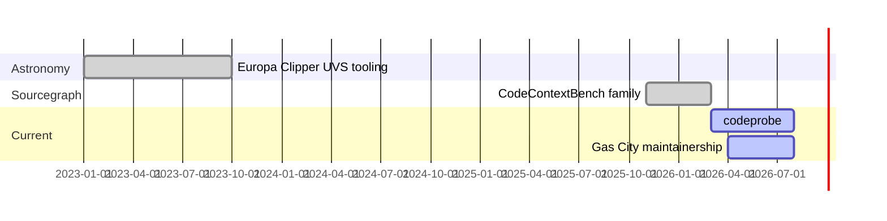

# PREVIEW — composed profile README concept (top 5 brainstorm picks layered)

*This is a mockup demonstrating the shortlisted devices with your real content. Numbers and links are real; copy is draft.*

---

# Stephanie Jarmak

I build benchmarks and tooling for AI coding agents[^1], maintain the Gas City multi-agent orchestration ecosystem[^2], and hold that a claim about agents is worth exactly the evidence behind it. Previously Sourcegraph[^3]; before that, planetary science and NASA ADS search[^4].

[^1]: Six public benchmark suites; see the report below. Flagship: [codeprobe](https://github.com/sjarmak/codeprobe), on PyPI.
[^2]: [gastownhall](https://github.com/gastownhall): gascity, beads, dashboard, packs. Contributions stage in my forks before landing upstream.
[^3]: Sales engineering and the CodeContextBench family, now archived as work history.
[^4]: Europa Clipper UVS observation planning; the thread continues in [scix-agent](https://github.com/sjarmak/scix-agent) (32.4M papers, 299M citation edges, 15 MCP tools).



## Results: benchmarks & evaluation

| task | what it measures | result | evidence |
|---|---|---|---|
| codeprobe | your whole agent setup, against your own merged PRs | on PyPI | [repo](https://github.com/sjarmak/codeprobe) |
| EnterpriseBench | cross-repo enterprise tasks | 112 tasks, 10 types | [repo](https://github.com/sjarmak/EnterpriseBench) |
| migration-evals | batch-change diffs through tiered oracles | 3 recipes shipped | [repo](https://github.com/sjarmak/migration-evals) |
| agent-diagnostics | why agents fail, taxonomically | 11,995 labeled trials | [repo](https://github.com/sjarmak/agent-diagnostics) |

> [!IMPORTANT]
> Finding: across 151 popular repos, 72-89% of surviving 2024+ lines are agent-written. Commit trailers only admit to 14.5%.



## Try the work (one line each)

```bash
pipx run codeprobe --help          # PR-derived agent evals
brew install sjarmak/tap/livedocs  # docs-drift detection over MCP (next release)
npx tom-swe                        # theory-of-mind memory for Claude Code
```

## Project lifespans

Archived means finished, not abandoned. The record:



---
*Preview ends. Full brainstorm: 30 ideas, 10 prior-art exclusion zones, ratings in `.brainstorm/profile-readme.md`.*
